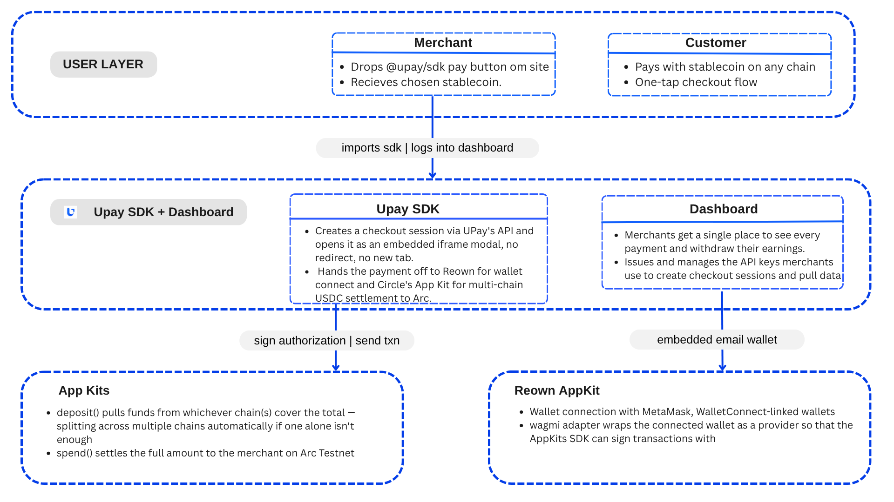

# UPay

**The universal payment button, for humans and agents.**

## Table of Contents

- [Description](#description)
- [Problem Statement](#problem-statement)
- [Features](#features)
- [High Level Architecture](#high-level-architecture)
- [Links](#links)
- [Future Vision](#future-vision)
- [Team](#team)

## Description

UPay is the universal payment button, for humans and agents. Accepts stablecoin payments from any chain, in a single tap. You settle in USDC on Arc, Circle's stablecoin L1. Powered by Circle App Kits' Unified Balance, it pools the customer's stablecoin balance across every chain they hold funds on into one Gateway-custodied balance, no bridging, no chain picker, no wallet-specific authorization type. The Stripe of crypto, made possible by chain abstraction, and built to work headlessly for autonomous agent payers just as well as human ones.

## Problem Statement

### 1. Fragmented Stablecoin Liquidity

Customers hold USDC scattered across a dozen chains, no single merchant integration can support them all.

### 2. Bridge Fatigue

Manually bridging, swapping, and switching networks before paying kills conversion and trust.

### 3. No Native Stablecoin Checkout

No simple, native way for merchants to accept stablecoins and settle on Arc, just clunky plugins and processors built for a different chain entirely.

## Features

### 1. One-Tap Checkout

Pay with USDC from whatever chain it lives on. No bridging, no network switching, no chain selection screen — Unified Balance reads the customer's USDC balance across every supported source chain and deposits from whichever chain(s) cover the amount, splitting automatically if needed.

### 2. Drop-In Pay Button

`<UPayButton />` — a Stripe-style component a merchant embeds on any storefront in minutes, published as [`upay-arc-sdk`](https://www.npmjs.com/package/upay-arc-sdk) on npm. Just a publishable API key and an amount; no custom checkout flow to build.

### 3. Merchant-Defined Settlement

The merchant sets their settlement token (USDC or EURC) once, from a dashboard, and every payment lands there on Arc, on-chain, automatically. Customers can still pay in from Arc, Base, or Ethereum testnets; the merchant never sees any of that.

## High Level Architecture

**Components**

- **UPay Button / SDK** — embeddable React component, published as [`upay-arc-sdk`](https://www.npmjs.com/package/upay-arc-sdk).
- **UPay Checkout** — hosted modal (embedded iframe): Reown wallet connect → deposit → spend → receipt.
- **UPay API** — checkout sessions, settlement config, API keys (Next.js API routes + Supabase).
- **Engine** — `@circle-fin/app-kit` (Unified Balance) with a viem adapter for EVM wallets.
- **Wallet layer** — Reown AppKit (`@reown/appkit` + `@reown/appkit-adapter-wagmi`), custom Arc Testnet chain definition (chain ID `5042002`).
- **Merchant dashboard** — payments, API keys, settlement settings, Treasury / Borrow (soon).

## Links

- Deployed URL: [www.upay.finance](https://www.upay.finance)
- SDK: [upay-arc-sdk](https://www.npmjs.com/package/upay-arc-sdk)
- Demo Store: [demo.upay.finance](https://demo.upay.finance)
- Presentation: [Pitch deck](https://canva.link/yzcjg8tfjsaobdtadd)

## Future Vision

### 1. Subscriptions

Real on-chain recurring payments, no re-approval per cycle. A merchant-controlled delegate EOA signs each recurring `spend()` after a single customer authorization, Arc App Kits' own documented delegate workflow ("the wallet remains the depositor, an authorized EOA signs each spend"), not a custom auth scheme. The schema already has a `subscriptions` table and `checkout_sessions.is_subscription` waiting for this.

### 2. Agent Payments

Extend UPay to support AI agents as customers, enabling autonomous agents to subscribe to services and make programmable USDC payments while leveraging the same merchant infrastructure a human checkout uses — no browser, no wallet popup required. This is the payoff on the "for humans and agents" half of the tagline.

### 3. Treasury

Settled USDC shouldn't sit idle. Auto-sweep it into USYC, Circle's tokenized short-term Treasury fund, so merchant balances earn yield without ever leaving Arc or converting to a different asset.

### 4. Borrow, against Treasury

Borrow USDC directly against your own Treasury/USYC position, not by posting ETH/BTC. Same asset class in and out: no cross-collateral risk, no unwinding a yield-bearing position just to access short-term liquidity, and no reintroducing the "any coin" problem the rest of UPay deliberately avoids.

### 5. Scale & Rails

Fiat settlement via off-ramp partners and mainnet rollout once Arc mainnet exists.

## Team

Built by **Team AlphaDevs**.
